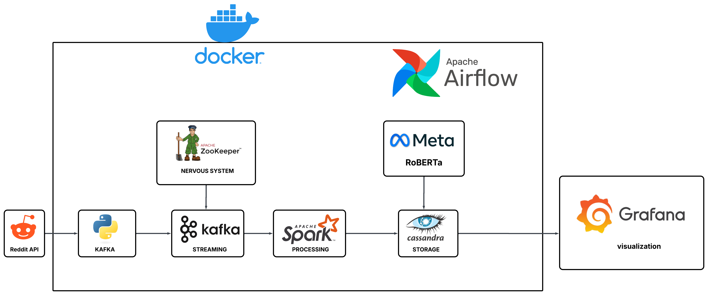

# Reddit News Trustworthiness Analyzer



## 🔍 Project Overview

This pipeline analyzes the reliability of news shared on Reddit by:
1. **Collecting** posts from selected news/political subreddits
2. **Processing** text content and metadata
3. **Evaluating** trustworthiness using:
   - Fake News Detection (RoBERTa model)
   - Source credibility analysis
   - Cross-verification patterns
4. **Visualizing** reliability scores per:
   - Subreddit
   - User
   - News domain
   - Time period
     |

## 🚀 Quick Deployment

```bash
# 1. Get the pretrained model
kaggle models download lambarkiaymane/fakenewsclassifier -p ./model
unzip ./model/fakenewsclassifier.zip -d ./model/final_model

# 2. Start services
docker-compose up -d